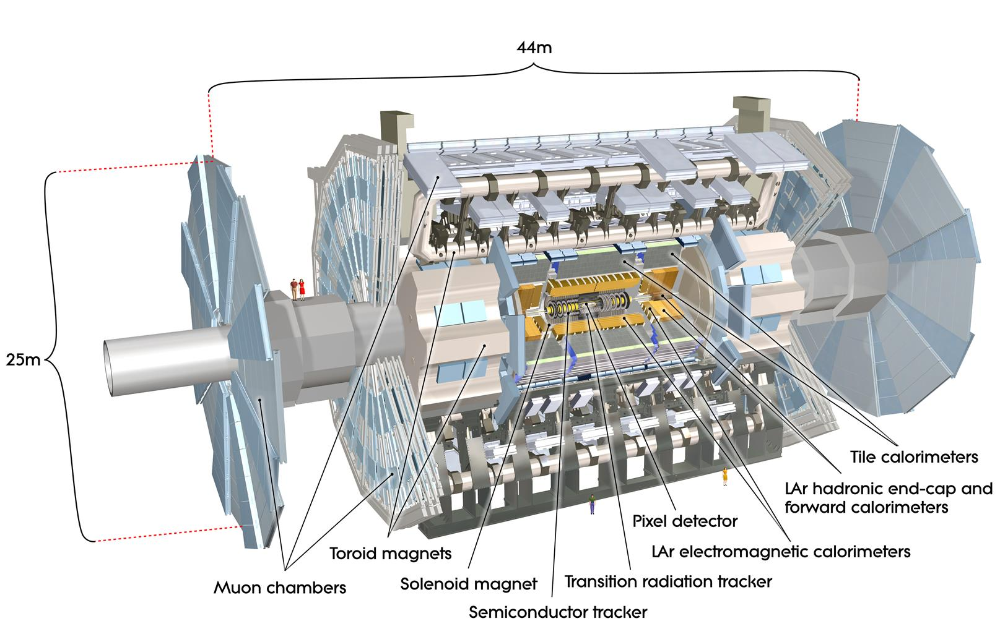

# Glossary

This is not intended to be an exhaustive glossary.  You will find answers to many of your questions by using a search engine.  However, here are afew ATLAS physics terms explained to start you off.

## Detector layout

The ATLAS detector has a layout that is typical for a collider detector.  There are two types of detector components: tracking detectors, which measure the position of a crossing charged particle with minimal disturbance, and calorimeters, which measure the energy of a particle by total absorption.

Travelling from the collision point outwards there exist tracking detectors \(inner detector\), then calorimeters \(electromagnetic and hadronic\) and then more tracking detectors \(muon spectrometer\).

The complete ATLAS detector is split into a barrel part, where detector layers are positioned on cylindrical surfaces around the beam axis, and two end-cap parts, where detector layers are positioned in planes of constant z perpendicular to the beam pipe.

## ATLAS coordinate system

The coordinate system of ATLAS is a right-handed coordinate system with the x-axis pointing towards the centre of the LHC tunnel, and the z-axis along the tunnel. The y-axis is slightly tilted with respect to vertical due to the general tilt of the tunnel.

## Azimuth angle, phi \($$\phi$$\)

The azimuthal angle $$\phi$$ is measured from the $$x$$-axis, around the beam.  
The ATLAS detector design is symmetrical in phi.

## Pseudorapidity \(eta\)

The pseudorapidity describes the angle of a particle relative to the beam axis.

## Opening angle

The opening angle \(also called angular separation\) between physics objects e.g.lepton pair, can be important in understanding or identifying different physics processes.  It is calculated as a function of eta and phi.

## Monte-Carlo generators

Monte-Carlo generators are programs used for simulating data.

## Good Run List

Good run lists are the way to select good data samples for physics analysis.

There are a number of ways the data may not be good e.g the LHC is not in stable-beam mode, the magnets are off, some of the sub-detectors are switched off.

## Jet

Jets are the dominant final state objects of high-energy proton-proton interactions at the LHC. They are key ingredients for many physics measurements and for searches for new phenomena. Jets are observed as groups of topologically-related energy deposits in the ATLAS calorimeters, most of which are associated with tracks of charged particles as measured in the inner detector. They are reconstructed and calibrated using a combination of methods based on simulation and data-driven techniques.

## Good, bad and ugly jets

Jet cleaning criteria have been developed in order to identify fake jets which arise due to noise or to out-of-time energy depositions. Jets failing these criteria are flagged as either “bad”, likely to be fake, or “ugly”, likely to be mismeasured due to falling into less well instrumented regions.

## Jet Vertex Fraction \(JVF\)

The Jet Vertex Fraction can be used to select jets with a high fraction of track energy originating from the selected primary vertex.  It can be used to suppress pile-up jets.

## Isolation

Isolation is important because it indicates where the lepton stems from.

For example, an isolated electron is likely to originate from $$Z$$ boson, $$W$$ boson or $$\tau$$-lepton.  In contrast, a non-isolated electron is likely to originate from $$b$$-hadron or $$c$$-hadron decays.

## $$p_{T}$$

The term $$p_{T}$$ stands for transverse momentum, the component of momentum perpendicular to the beam line.

In proton-proton collisions the overall momentum along the beamline is not known.  This is because protons are composite particles consisting of many partons \(quarks and gluons\).  When two protons collide it is actually the partons that interact.

Each of the partons carries an unknown fraction of the protons momentum.  So their exact momentum along the beamline is unknown.  We only know that the overall momentum perpendicular to the beamline is zero before the collision.  Thus, transverse momentum is the most important momentum variable in a proton-proton collision.

## Event

An event is a snapshot of a collision in the LHC. Energy is equivalent to mass, so highly energetic collisions can create particles more massive than those involved in the collisions \(protons, in the case of the LHC\). These massive particles quickly decay into lighter stable particles. Physicists study the decay products of collisions to determine what particles were created in the events.

## Signal

High-energy physicists, whether making a precise measurement of a known quantity or searching for hypothetical new particles, select from the sample of events recorded those with characteristics resembling those of the desired signal, while rejecting as many non-signal events \(background\) as possible.

## Background

Data contains both signal and background events.  Background events are rejected so that the desired physics processes can be observed.

## Fundamental Particles

Fundamental particles are the building blocks of matter as they are all indivisible. All other particles are therefore  a combination of the fundamental particles.

## Fundamental Forces

The fundamental forces, explain the interactions between particles in our universe. These  forces are gravity, electromagnetism, the strong and the weak force. Electromagnetism and the weak force are linked through the electroweak theory.

## Fermion

A subatomic particle, such as a nucleon, which has half-integral spin and follows a statistical description given by Fermi and Dirac.

## Boson

A subatomic particle, such as a photon, which has zero or integral spin and follows a statistical description given by S.N. Bose and Einstein.

## Channel

The decay channel signifies a certain route a physics process has taken.

For example, the $$W$$ boson may decay to either a pair of hadrons or a pair of leptons. The signature for these W bosons in the detector are therefore either two hadrons or two leptons. These may be referred to the hadronic and leptonic channel of the W boson decay, respectively. If we want to study an object we cannot directly observe, e.g. a W boson, we must find a channel that is easily accessible.

In general, decays to leptons are easiest to spot but are not as abundant as hadronic decays.

## Branching fraction

In general, a particle can decay in several modes or decay channels.

For example, a Z boson can decay into a pair of neutrinos, a pair of charged leptons, or a pair of quarks \(i.e., all the standard model fermions lighter than half the $$Z$$ mass\). The probability for a Z to decay into a neutrino pair is about 20%, into a pair of charged leptons \(electrons, muons, or taus\) is about 10%, and into a pair of quarks \(u,d,c,s,b\) is about 70%. These probabilities are called branching fractions.

## Electron Volt \(eV\)

One electron volt is equal to ~1.6 X 10^-19 joules.   
MeV \(10^6\) and TeV \(10^12\) are units of energy used in particle physics. 1 TeV is about the energy of motion of a flying mosquito.

## Antiparticle

Antimatter: A particle and its antiparticle have the same mass as one another, but opposite electric charge and other quantum numbers. A collision between any particle and its antiparticle partner leads to their mutual annihilation, giving rise to various proportions of photons, neutrinos, and sometimes less massive particle–antiparticle pairs.

## Parton Distribution Functions

The momentum distribution functions of the partons \(quarks and gluons\) within the proton are called Parton Distribution Functions.

## Vectorial sum

A vectorial sum is the result of adding two or more vectors together via vector addition.

