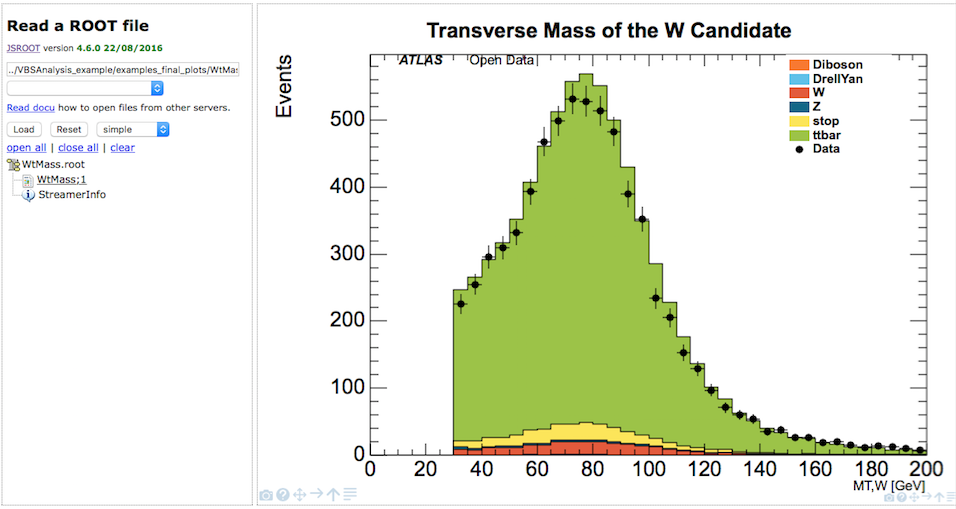

# ROOTbrowser final plots

##Complex High Energy Physics (HEP) plots in action.##

ROOTbrowser also allows you to take a look at some prepared HEP histograms. 

An analysis has been implemented for single $$W$$ boson events where the $$W$$ boson decays to leptons.

The drop-down menu (second text box) contains a number of examples of final plots from this $$W$$ analysis.

As before, select the file you are interested in

In this case 'examples_final_ploys/WtMass.root

Press 'Load' button

Then display the histogram.  In this case, click on 'WtMass;1'

Data is displayed with black filled dots.
The various simulated samples are shown in filled colours, stacked ontop of each other.  The overall shape of the combined simulated samples is very similar to the data distribution.  There is fairly good agreement between data and simulated data.  

The $$W$$ analysis is potentially prone to QCD contributions as there is only one lepton present which may come from non-prompt sources mimicking the desired final state. Therefore, potential disagreements must always be understood as a sign that the QCD contributions are not taken into account. QCD samples were not included as these have very low statistics after a selection while having a large file size.

The distributions of the transverse mass as well as the missing transverse momentum are affected by the omission of QCD contributions, which predominantly populate the low missing transverse momentum and low transverse mass regions.

The magnetic field bends the charged particles thus allowing measurement of the momentum by using the curvature of the tracks.
The histogram shows the momentum of the lepton transverse to the beam.

If you hover your cursor over a data point, statistics boxes will be shown.  The bottom box shows the information for data, so in this case there are 858 leptons with $$p_T$$ between 50 and 60 GeV.  The top statistics box shows the total simulated data contribution, 961.4 entries.  

Lepton energy is measured by the electromagnetic calorimeters.
The overall description of the lepton kinematics by the simulated data is good.

Less well described are the tracking and isolation variables.
This suggests that QCD contributions are missing. In this region QCD processes would contribute by either the misidentification of a jet as a lepton or by a hadron decay to leptons inside a jet. These so-called non-prompt leptons are not well isolated resulting in higher values for the isolation variables.

Jet MV1 displays the b-tagging weight obtained from a jet tagging algorithm based on Multi-Variate techniques. High values indicate jets originating from $$b$$-quarks (b-tagged jets).

The jet variables are reasonably well described by the simulated data.
The slight disagreement may be attributed to missing QCD contributions.

##Example final plots available##
* WtMass : Transverse Mass of the $$W$$ boson candidate
* etmiss : Missing transverse momentum
* jet_MV1 : Weight from algorithm based on Multi-Variate techniques
* jet_eta : Jet pseudorapidity
* jet_jvf : Jet Vertex Fraction (JVF)
* jet_m : Jet mass
* jet_pt : Jet momentum
* lep_E : Lepton energy
* lep_charge : Lepton charge
* lep_d0 : The signed transverse impact track parameter
* lep_eta : Lepton pseudorapidity
* lep_etconerel20 : Scalar sum of ET of tracks in a cone of R=0.2 around lepton, not including lepton ET itself
* lep_n : Number of leptons
* lep_phi : Lepton phi
* lep_pt : Lepton transverse momentum
* lep_ptconerel30 : Scalar sum of $$p_T$$ of tracks in a cone of R=0.3 around lepton, not including lepton $$p_T$$ itself
* lep_type : Number signifying the lepton type (electron, muon, tau)
* lep_z0 : Z-coordinate of the track associated to the lepton wrt the primary vertex
* n_jets : Number of jets
* pvxp_n : Number of primary vertices
* vxp_z : Z-position of the primary vertex
